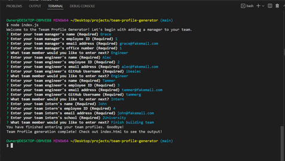
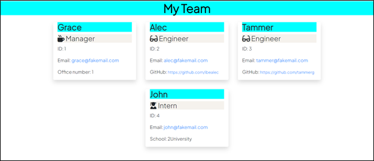
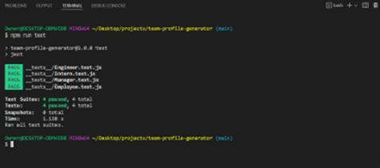

# **Team Profile Generator**

## **Description**
The purpose of this project was to build a Node.js command-line application obtaining information about employees of a software engineering team, including their names, IDs, email addresses, roles (whether a Manager, Engineer, or Intern), and role-specific information (office number, GitHub username, school). The program takes the data obtained from the application and automatically generates an HTML webpage to display all of the employee information. 

 

## **Table of Contents**
[User Story](#user-story) 
[Acceptance Criteria](#acceptance-criteria) 
[Installation](#installation) 
[Usage](#usage) 
[License](#license) 
[Contributing](#contributing) 
[Tests](#tests) 
[Assets Utilized](#assets-utilized) 
[Built With](#built-with) 
[Deliverable](#deliverable) 

 

### **User Story**
AS A manager 
I WANT to generate a webpage that displays my team's basic info 
SO THAT I have quick access to their emails and GitHub profiles 

### **Acceptance Criteria**
GIVEN a command-line application that accepts user input 
WHEN I am prompted for my team members and their information 
THEN an HTML file is generated that displays a nicely formatted team roster based on user input 
WHEN I click on an email address in the HTML 
THEN my default email program opens and populates the TO field of the email with the address 
WHEN I click on the GitHub username 
THEN that GitHub profile opens in a new tab 
WHEN I start the application 
THEN I am prompted to enter the team manager’s name, employee ID, email address, and office number
WHEN I enter the team manager’s name, employee ID, email address, and office number 
THEN I am presented with a menu with the option to add an engineer or an intern or to finish building my team 
WHEN I select the engineer option 
THEN I am prompted to enter the engineer’s name, ID, email, and GitHub username, and I am taken back to the menu 
WHEN I select the intern option 
THEN I am prompted to enter the intern’s name, ID, email, and school, and I am taken back to the menu 
WHEN I decide to finish building my team 
THEN I exit the application, and the HTML is generated 

 

### **Installation**
(1) Click [here](https://nodejs.org/en/) to install Node.js on your local machine if you haven't already done so. Choose the latest LTS version for the most recent stable release.  
(2) Clone this repository on your local machine. 
(3) Navigate to the repository folder. 
(4) Type the following command in the command line to download all required packages/modules.dependencies: 

    npm install

 

### **Usage**
(1) Once the installation instructions above have been completed, navigate to the folder in which the project files are stored and run the following in the command line: 

    node index.js

(2) Users will then be welcomed to the application and then asked to complete a series of questions about themselves (team managers). A sample screen shot of the command-line application appears below:  

(3) Once all questions about the team members are answered and the user chooses "Finished building team", a message indicating that the application program has finished appears in the command line. An index.html file will be automatically generated and stored in the "dist" folder of the project repository. All of the data will be formatted and readily available for the manager's reference. 

(4) A sample index.html file has been stored within this repository and can be found [here](dist/index.html). Below is a screen shot of the webpage built from the sample index.html file:

 

### **License**
  This project is covered under the following license: ISC 
  https://opensource.org/licenses/ISC

 

### **Contributing**
This project does not include any contributors

 

### **Tests**
This application has been tested via Jest. All classes (Employee, Manager, Engineer, and Intern) have been tested and appear in the __tests__ folder. A screen shot of the Jest tests output appears below:

 

### **Assets Utilized** 

- __tests__ folder containing all class test files
- __lib__ folder containing all constructed class files
- page-template.js
- index.js
- style.css

 

### **Built With**
* HTML
* CSS
* JavaScript
* Node.js
* npm
* Inquirer.js
* Jest

 

### **Video of README Generator**
https://drive.google.com/file/d/1H6pDqyKK7AA346FSRiCmI7-5DXPCLbf1/view

